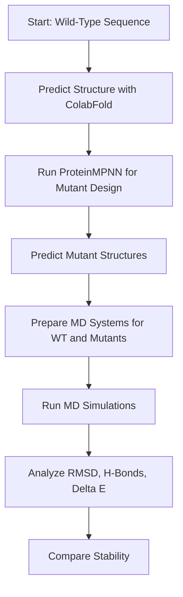

# 🧬 Protein Stability Optimization with AI + Molecular Dynamics

**Author:** [Your Name]  
**Project Type:** Computational Protein Design + Machine Learning + Molecular Simulation  
**Status:** 🚧 In Progress  
**Estimated Time:** ~5 weeks (1 hour/day)

---

## 📍 Project Overview

This project explores the use of **AI-based protein sequence design** tools, such as **ProteinMPNN** and **ThermoMPNN**, to generate stabilizing mutations in a well-characterized model protein. The stability of the wild-type and designed mutants is then evaluated using **Molecular Dynamics (MD)** simulations and structural analysis.

The entire workflow is built to be a practical, portfolio-worthy demonstration of integrating **machine learning**, **protein engineering**, and **physics-based simulation**.

---

## 🎯 Objectives

- ✅ Predict stabilizing mutations using **ProteinMPNN** or **ThermoMPNN**
- ✅ Predict wild-type and mutant 3D structures using **ColabFold**
- ✅ Simulate the wild-type and mutant protein structures using **OpenMM** or **GROMACS**
- ✅ Analyze simulation results (RMSD, hydrogen bonds, ΔΔG proxies)
- ✅ Evaluate and visualize structural stability differences
- ✅ Create a clean, reproducible, and documented project for your GitHub portfolio

---

## 🛠️ Tools and Technologies

| Tool/Library             | Purpose                                        |
|--------------------------|------------------------------------------------|
| **ProteinMPNN**          | AI-based sequence design / inverse folding     |
| **ColabFold**            | Structure prediction (AlphaFold2 on Google Colab) |
| **OpenMM** or **GROMACS**| Molecular Dynamics engine                      |
| **Python + NumPy + matplotlib** | Data analysis and plotting          |
| **PyMOL / VMD**          | Structure visualization (optional)            |

---

## 🧪 Protein Target

- **Protein:** T4 Lysozyme (mutant L99A or wild-type)
- **PDB ID:** [2LZM](https://www.rcsb.org/structure/2LZM)
- **Length:** ~164 residues
- **Why this target?** It's well-studied, small, and has known stability mutants — ideal for benchmarking AI design tools and simulations.

---

## 🧭 Workflow Summary



---

## 📁 Repository Structure

```
protein-stability-optimization/
│
├── README.md                ← This file
├── data/
│   └── wt_structure.pdb     ← Predicted WT structure
├── designs/
│   ├── mpnn_input/          ← Input files for ProteinMPNN
│   └── mpnn_output/         ← Output mutant sequences
├── md_simulations/
│   ├── wt/                  ← MD files for wild-type
│   └── mutant1/             ← MD files for mutant 1 (more can be added)
├── notebooks/
│   └── analysis.ipynb       ← RMSD, stability plots, etc.
├── scripts/
│   └── run_mpnn.py          ← Run design pipeline
└── results/
    └── figures/             ← RMSD, H-bond plots, structure images
```

---

## 📊 Key Analyses

- **RMSD Time Series**: Track deviation over time to compare stability.
- **Hydrogen Bond Networks**: Quantify internal stability.
- **Radius of Gyration (Rg)**: Structural compactness.
- **ColabFold Confidence Scores**: PLDDT and pLDDT-based metrics.
- **(Optional)**: Solvent exposure, secondary structure evolution.

---

## 📈 Future Improvements

- Add support for **SolubleMPNN** for membrane targets.
- Integrate **free energy calculations** (MM-PBSA or alchemical).
- Evaluate multiple mutations in combination.
- Add **dashboard-style visualization** (e.g., using Plotly or Streamlit).

---

## 🧠 Learning Outcomes

✅ Apply cutting-edge AI tools for inverse protein design  
✅ Predict 3D structures using ColabFold  
✅ Run and analyze MD simulations for protein stability  
✅ Build a reproducible and presentable research project  
✅ Practice clean GitHub documentation and workflow sharing

---

## 👀 Example Visuals (To Be Added)

- [ ] WT vs mutant RMSD plot  
- [ ] Structure alignment images  
- [ ] Energy/interaction heatmaps  

---

## 📌 License and Citation

This is an academic/personal learning project. Please cite the tools used (ProteinMPNN, ColabFold, etc.) appropriately in your own work.

---